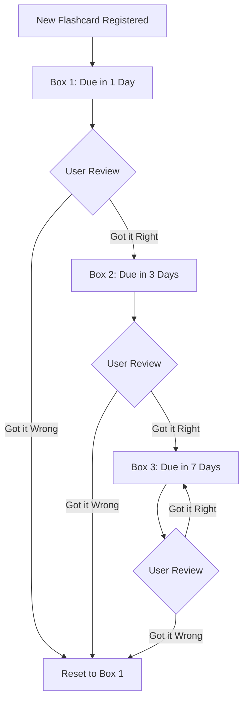

# CodeRespite: Refresh Your Tech Skills 🐾

CodeRespite is a gamified, AI-powered micro-learning mobile application built with React Native and Expo. Tailored for software engineers prepping for technical interviews or developers establishing daily learning habits, it combines spaced repetition, active recall, and a personalized AI tutor - **Meowgrammer** 🐾 - to make code learning engaging and effective.

---

## 📖 Table of Contents
1. [Overview & Core Value Proposition](#-overview--core-value-proposition)
2. [Product Features & Architecture](#-product-features--architecture)
3. [Technical Stack](#%EF%B8%8F-technical-stack)
4. [Project Directory & File Structure](#-project-directory--file-structure)
5. [Spaced Repetition System (SRS) Mechanics](#-spaced-repetition-system-srs-mechanics)
6. [AI Engine & Prompts (Groq AI)](#-ai-engine--prompts-groq-ai)
7. [Database & Local Storage Sync](#-database--local-storage-sync)
8. [Setup & Installation](#%EF%B8%8F-setup-and-installation)
9. [Destya Studio Standards & Gatekeeping](#-destya-studio-standards--gatekeeping)
10. [Future Prospects & Growth Strategy](#-future-prospects--growth-strategy)

---

## 🌟 Overview & Core Value Proposition

In a landscape filled with long-form video courses and dry textbooks, CodeRespite provides **developer-focused micro-learning**. 

### The Problem
Developers suffer from information overload. When prepping for interviews or trying to keep up with new frameworks, standard online tutorials feel passive and fail to build retention.

### The Solution
CodeRespite offers **active recall** learning using three primary pillars:
*   **Gamified Learning Tracks:** Interactive quizzes and beautifully animated flashcards.
*   **"Bring Your Own Key" (BYOK) AI Integration:** Unlimited access to AI-powered roadmaps, detailed quiz explanations, and a floating tutor chatbot, removing subscription paywalls for developers.
*   **Habit-Building Gamification:** Developer-themed contribution heatmaps (similar to GitHub commits), XP points, achievements, and level-ups.

---

## 🚀 Product Features & Architecture

### 1. Ask Meowgrammer AI Chatbot 💬
*   **Persona:** Meowgrammer, a playful, friendly, and patient AI developer cat tutor.
*   **Function:** Users can ask questions about code syntax, paste error logs, or ask for developer career advice directly from any part of the app.
*   **Implementation:** Powered by the **Groq API** (Llama-3 model) for ultra-low latency streaming responses.

### 2. Personalized Roadmap Generator 🗺️
*   **Dynamic Learning:** Users can input any technical goal (e.g., *"Master React Hooks"* or *"Prepare for SQL joins in 3 days"*).
*   **AI Curriculum:** Groq parses the goal and instantly outputs a customized learning roadmap, complete with tailored flashcards and quizzes.

### 3. Smart Spaced-Repetition Flashcards 🧠
*   **Spaced Repetition System (SRS):** Built on the Leitner Box model to optimize memory retention.
*   **Interactive Cards:** Cards flip smoothly via `react-native-flip-card` and allow users to mark cards as "Got it" or "Need review".

### 4. Smart Resumption & Streak Tracking 🔥
*   **"Jump Back In" Card:** Calculates progress and lets the user resume exactly where they left off with one click.
*   **Contribution Heatmap:** A visual 2D grid (`StreakHeatmap.js`) that represents daily study activity, mimicking GitHub's commit graph.

---

## 🛠️ Technical Stack

*   **Framework:** [Expo v53](https://expo.dev) & [React Native 0.79](https://reactnative.dev)
*   **Navigation:** [Expo Router v5](https://docs.expo.dev/router/introduction) (File-based routing)
*   **Styling:** [NativeWind v4](https://www.nativewind.dev/) (Tailwind CSS for React Native)
*   **AI SDK/API:** Direct REST/Fetch integrations with **Groq Cloud API**
*   **Database/Backend:** **Firebase (Firestore)** for course content synchronization, badge lists, and global/user configurations.
*   **Local Storage:** **AsyncStorage** (for progress tracking, quiz scores, heatmaps) & **SecureStore** (for user API keys).
*   **Monetization:** `react-native-google-mobile-ads` (AdMob banner, app-open, and interstitial integrations).
*   **Crash Reporting:** **Sentry React Native** for tracking runtime errors.

---

## 📁 Project Directory & File Structure

```bash
├── app/                      # Expo Router App Entry & Routes
│   ├── (tabs)/               # Bottom Tab-based Navigation
│   │   ├── _layout.js        # Configures Tab Icons & Theme Styling
│   │   ├── index.js          # Home Dashboard (Heatmap, "Jump Back In", Daily Quiz)
│   │   ├── learn.js          # Courses list page
│   │   ├── quiz.js           # Quizzes listing page
│   │   ├── flashcards.js     # Saved Flashcards/SRS Review deck
│   │   └── profile.js        # User Profile, Badges list, & Custom API Keys
│   ├── learn/                # Course Viewer Pages
│   ├── quiz/                 # Interactive Quiz Engines
│   ├── settings/             # Settings Page (Ad preferences, Sentry toggle)
│   ├── _layout.tsx           # Global App Shell, Theme Providers, & Web Gatekeeper
│   ├── chat.js               # Floating / Main Chat interface with Meowgrammer
│   ├── index.js              # Entry Router (Auth & onboarding router)
│   └── global.css            # Tailwind / Nativewind configuration
│
├── components/               # Reusable UI Components
│   ├── StreakHeatmap.js      # Custom GitHub-style streak chart
│   ├── FlashCardItem.js      # Flip card with SRS buttons
│   ├── BadgeModal.js         # Dialog that celebrates unlocked achievements
│   ├── LevelUpModal.js       # Dialog notifying users when XP triggers new levels
│   ├── UpdateModal.js        # Forces/suggests app updates from version.json
│   ├── MoreApps.js           # Cross-promotional card for other Destya Studio apps
│   ├── QuickStats.js         # Stats dashboard (XP, Level, Streaks)
│   └── SafeScreen.js         # SafeAreaView Wrapper with platform-specific padding
│
├── services/                 # Core Logic, API Integrations & Services
│   ├── groqService.js        # Groq API integration (Roadmaps, Quiz answers, Chat)
│   ├── srsService.js         # Leitner Box active recall algorithm
│   ├── badgeService.js       # Achievement evaluator based on user statistics
│   ├── firebaseConfig.js     # Initialization configurations for Firebase
│   ├── userStorage.js        # Sync helper for local user states & Firestore backups
│   ├── AdManager.js          # Google Mobile Ads (AdMob) manager & lifecycle listeners
│   └── analyticsService.js   # Firebase Analytics logging system
```

---

## 🧠 Spaced Repetition System (SRS) Mechanics

Spaced repetition uses the **Leitner Box System** to optimize retention intervals. 



### Leitner Intervals Defined in [srsService.js](file:///media/amit/Other1/webdevelopment/github/coderespite/services/srsService.js)
```javascript
const BOX_INTERVALS = {
  1: 1, // Review in 1 day
  2: 3, // Review in 3 days
  3: 7, // Review in 7 days (maximum box cap)
};
```
*   **Promotion:** Getting an answer correct moves the card up a box (max 3), increasing the interval.
*   **Demotion:** Getting an answer incorrect immediately resets the card to Box 1, requiring daily review until memorized.
*   **Due Logic:** Cards are fetched where `nextReviewDate <= currentUtcDate`.

---

## 🤖 AI Engine & Prompts (Groq AI)

The AI engine in [groqService.js](file:///media/amit/Other1/webdevelopment/github/coderespite/services/groqService.js) handles dynamic chat, explanation requests, and syllabus creation.

### 1. Meowgrammer Personification Prompt
```text
You are Meowgrammer, a playful, friendly, and patient AI developer cat tutor. 
Use coding puns, occasional cat emojis (🐾, 🐱, 😻), and purr-fect programming language references. 
Always explain code concepts clearly, provide concise examples, and guide the user step-by-step.
```

### 2. Custom Roadmap Schema (JSON Mode)
When requesting custom roadmaps, the service forces the model to respond in a strict JSON array configuration using structured schema output constraints:
```json
{
  "title": "Roadmap Title",
  "description": "Short overview",
  "modules": [
    {
      "moduleTitle": "Module Name",
      "flashcards": [{"question": "...", "answer": "..."}],
      "quizzes": [{"question": "...", "options": ["..."], "correctAnswer": "...", "explanation": "..."}]
    }
  ]
}
```

---

## 💾 Database & Local Storage Sync

To maintain privacy and permit seamless offline learning, CodeRespite utilizes a Hybrid Storage model:

1.  **Local First:**
    *   `AsyncStorage` stores XP, Level, Streak metadata, Study heatmap history, Course completions, and SRS flashcards.
    *   `SecureStore` protects the user's custom Groq API Key.
2.  **Remote Sync:**
    *   `userStorage.js` automatically backs up the user profile progress metadata to Firebase Firestore when online.
    *   This ensures cross-device tracking when users log in.

---

## ⚙️ Setup and Installation

### Prerequisites
*   Node.js (v18+)
*   Expo CLI (`npm install -g expo-cli`)
*   Cocoapods (for iOS development builds)
*   Android Studio & SDK (for Android emulator setups)

### Step 1: Install Dependencies
```bash
npm install
```

### Step 2: Configure Environment Variables
Create a `.env` file in the root directory:
```env
EXPO_PUBLIC_GROQ_API_KEY=your_fallback_groq_api_key
EXPO_PUBLIC_FIREBASE_API_KEY=your_firebase_api_key
EXPO_PUBLIC_FIREBASE_AUTH_DOMAIN=your_firebase_auth_domain
EXPO_PUBLIC_FIREBASE_PROJECT_ID=your_firebase_project_id
EXPO_PUBLIC_FIREBASE_STORAGE_BUCKET=your_firebase_storage_bucket
EXPO_PUBLIC_FIREBASE_MESSAGING_SENDER_ID=your_firebase_sender_id
EXPO_PUBLIC_FIREBASE_APP_ID=your_firebase_app_id
EXPO_PUBLIC_FIREBASE_MEASUREMENT_ID=your_firebase_measurement_id

# AdMob App IDs (Pre-configured in app.config.js for test ads, replace in production)
EXPO_PUBLIC_ADMOB_ANDROID_APP_ID=ca-app-pub-...
EXPO_PUBLIC_ADMOB_IOS_APP_ID=ca-app-pub-...
```

### Step 3: Run the Application
```bash
# Start Metro bundler
npx expo start

# Run on Android Device / Emulator
npm run android

# Run on iOS Device / Simulator
npm run ios

# Run web wrapper preview
npm run web
```

---

## 📐 Destya Studio Standards & Gatekeeping

As a Destya Studio mobile app, CodeRespite adheres to strict structural standards:

1.  **Theme branding:** Primary colors lean on Deep Indigo (`#132F94`), Dark Slate (`#0C1D59`), and Accent/CTA Neon Amber (`#FFA500`).
2.  **built by destyastudio Stamp:** Placed at the bottom of splash layouts in small monospaced styling.
3.  **Web Simulator Container:** Desktop web builds restrict display dimensions to a 480px width mobile emulator layout centered on the browser viewport to drive native app downloads.
4.  **BYOK (Bring Your Own Key):** Offers free fallback AI access, but enables developers to enter their personal keys to bypass rate limiting.

---

## 🔮 Future Prospects & Growth Strategy

To expand active user engagement, the app is prepared for the following updates:

*   **Interactive Visual Roadmap Graphs:** Render roadmaps as nodes connected with SVG paths instead of list formats, making the progression feel like a game tree.
*   **Offline-First Cache Warming:** Automatically pull down course structures during initial boot and save them to SQL Lite or AsyncStorage so that core quizzes and flashcards function completely disconnected.
*   **Multi-Lingual Dev Prep:** Localize key programming tracks and Meowgrammer prompts to support Spanish, Portuguese, Hindi, and Mandarin.
*   **Multiplayer Quiz Competitions:** Add socket-based asynchronous quiz battles so engineers can challenge teammates or peers.
